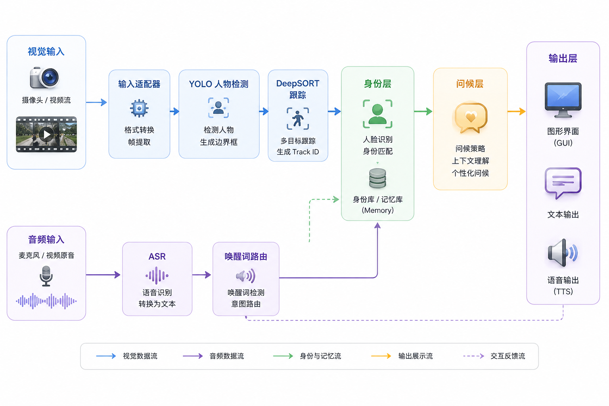

# Family Robot Architecture

## 1. 系统总览

Family Robot 是一个本地运行的家庭交互机器人 Demo。它关注的不是“识别所有能力”，而是把一条完整、可演示、可解释的家庭交互链路跑通：

1. 识别人
2. 追踪人
3. 绑定长期身份
4. 由身份决定问候语
5. 用语音唤醒交互

系统采用本地优先的分层架构，视觉、身份、交互、语音和界面彼此解耦，方便后续替换模型或升级能力。

核心原则：

- `track_id` 只是临时轨迹号
- `identity_id` 才是长期身份
- 语音负责“触发交互”
- 身份负责“决定怎么回应”

## 2. 总体架构图

这张图和本项目的实际链路是对齐的：

- 蓝色是视觉链路
- 紫色是音频链路
- 绿色是身份与记忆链路
- 橙色是输出展示链路

## 3. 模块职责

### 3.1 输入适配器

负责把不同输入统一成可处理的数据流：

- 摄像头输入
- 本地视频输入
- 音频输入或从视频中提取的音轨

### 3.2 视觉管线

视觉管线只做三件事：

- 检测画面里的人
- 维持短期轨迹连续性
- 把当前轨迹交给身份层

其中：

- YOLO 负责“有没有人、在哪里”
- DeepSORT 负责“这个人是否是上一帧那个目标”

### 3.3 身份层

身份层负责把“轨迹上的人”变成“长期身份上的人”。本项目的身份层主要由 `InsightFace + FAISS + 本地登记库` 组成。它包含：

- 本地登记数据加载
- 人脸特征提取
- 身份检索与匹配
- 轨迹消失后的身份恢复
- 未知身份的兜底处理

### 3.4 交互层

交互层负责把识别结果转成对人的回应：

- 监听唤醒词
- ASR 转录文本
- 根据当前身份选择问候语
- 通过 TTS 播放

### 3.5 展示层

GUI 只负责把运行结果可视化，不参与核心判定：

- 检测框
- 轨迹 ID
- 身份标签
- 唤醒与问候日志
- 每段耗时

## 4. 数据流说明

### 4.1 视觉主链路

1. 摄像头或本地视频进入输入适配器。
2. 输入适配器完成格式统一和帧提取。
3. YOLO 检测画面中的人，并输出边界框。
4. DeepSORT 在连续帧之间维持短期轨迹，并生成 `track_id`。
5. 身份层根据轨迹关联的人脸特征去登记库中检索长期身份。
6. 识别结果进入问候层，生成个性化回应。
7. 输出层把检测框、`track_id`、身份标签和问候结果同步展示到 GUI。

### 4.2 音频触发链路

1. 麦克风或视频音轨进入音频输入分支。
2. ASR 将语音转成文本。
3. 唤醒词路由判断当前文本是否触发交互。
4. 只有命中唤醒条件时，问候层才会参与生成回复。
5. 生成的回复通过 TTS 播放，同时写入 GUI 日志。

### 4.3 身份反馈链路

1. 身份库保存已登记成员的本地特征。
2. 身份层在单帧识别后，会把长期身份结果回传给交互层。
3. 当轨迹短暂消失或重新出现时，身份层负责恢复同一个长期身份。
4. 这样可以避免把临时 `track_id` 误当成最终身份。

## 5. 运行时序

运行顺序可以理解为：

1. 用户输入摄像头、视频或音频。
2. 输入源进入采集适配器。
3. 视觉层先完成检测，再完成跟踪。
4. 身份层把轨迹映射成长期身份。
5. 交互层根据身份和唤醒状态生成回应。
6. GUI 负责同步展示和播放结果。

## 6. 目录结构

- `src/`
- `familyrobot/capture.py` 输入适配
- `familyrobot/detection.py` YOLO 封装
- `familyrobot/tracking.py` DeepSORT 封装
- `familyrobot/identity.py` InsightFace 特征提取、FAISS 检索、身份恢复
- `familyrobot/enrollment.py` 本地登记存储
- `familyrobot/greetings.py` 个性化问候
  - `familyrobot/voice.py` 唤醒词、ASR、路由
  - `familyrobot/speech.py` TTS 后端
  - `familyrobot/realtime_gui.py` 实时编排与叠加
  - `familyrobot/realtime_window.py` PySide6 窗口
  - `familyrobot/video_voice.py` 视频音频对齐辅助
- `tests/` 单元测试与集成测试
- `docs/` 架构、决策、阻塞项、协作记录
- `data/enrollment/` 本地登记图像与身份数据
- `models/` 本地模型文件

## 7. 运行路径

### 7.1 实时摄像头模式

摄像头 -> 采集 -> YOLO -> DeepSORT -> 身份层 -> GUI

若开启语音：

麦克风音频 -> 唤醒词 / ASR -> 路由 -> 问候 -> TTS

### 7.2 本地视频模式

视频文件 -> 解码 -> YOLO -> DeepSORT -> 身份层 -> GUI

若开启视频音轨：

视频音轨 -> 分段对齐 -> 唤醒词 / ASR -> 路由 -> 问候 -> TTS

### 7.3 登记模式

GUI -> 样本图像 -> 本地登记库 -> 清单 / 特征模板

## 8. 设计要点

- 轨迹和身份必须分离。
- 语音只负责触发，不负责判定身份。
- 本地优先，避免依赖云端服务影响复现。
- 多人场景下的发起者推测属于演示型能力，不等同于正式说话人识别，暂时简化实现方便演示。
- 模块化设计的目的是让后续升级可以替换单独一层，而不用推翻整条链路。
